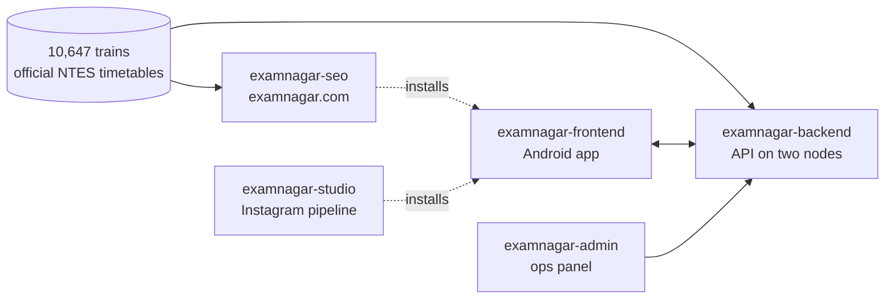

### Hi, I'm Manjot 👋

**I design, ship and run production systems.**

The main one is **[ExamNagar](https://examnagar.com)**, a travel planner for Indian government-exam candidates. It answers one question end to end: *will I reach my exam centre on time, and how?* It is live on Google Play, publishes 16,640 static route pages, and runs on an API load-tested to **4,300 requests a second with 0.00% failed**.

Alongside it, **[Sarkari Engine](https://sarkari.site)** builds government recruitment pages only from what official boards publish.

---

#### ExamNagar: five repos, one system

A candidate enters their home and their exam centre. The app finds the nearest well-connected stations, ranks every train by how much buffer it leaves against that exam's reporting deadline, then tracks the journey by GPS on exam day and warns them if their train will make them late.

| Repo | What it is | Proof |
|---|---|---|
| `examnagar-backend` | Node 22 API on two production nodes | 4,300 rps, 0.00% failed |
| `examnagar-frontend` | React 19 + Capacitor Android app | Live on Google Play |
| `examnagar-seo` | Zero-dependency static site generator | 16,640 pages |
| `examnagar-studio` | Instagram content pipeline | 126 tests passing |
| `examnagar-admin` | Operations panel, 38 endpoints | Surfaced 9 production bugs |

*The source for all six repos on this page is private for now. I'm happy to walk through any of it: [email me](mailto:manjotsingh620026@gmail.com).*

<b>examnagar-backend</b>: the hard parts

- **A ranking bug that hid a Vande Bharat.** Station discovery took the five nearest stations, then dropped the poorly connected ones. For an east-Patna centre that pool held two zero-train halts, while Patliputra, where every north-Bihar train terminates, sat at distance rank 19 and never got in. Users were told "no direct train". Filtering on train count *inside* the geo query and capping last took one corridor from **0 direct trains to 20**.
- **Offline train search.** An in-memory inverted index over 10,647 trains, `Map<station, Set<train>>`, intersected on the smaller set. Under 100 ms per search, no API cost.
- **One payload cap, twice the throughput.** Travel plans stored every route found, up to 122 per corridor, for a mean of 332 KB. Capping at 10 brought it to 17 KB and took the ceiling from about 2,000 to 4,300 rps.
- **Measure before moving.** Redis was sending 24.6× more bytes than it received and saturating the primary's NIC, so it moved to the app node. MongoDB moved 5.76 MB in the same test and stayed where it was.
- **80% of traffic on a Spot VM.** A drain path, a reserved IP, a Cloud Run watchdog, and about two minutes of measured recovery from preemption. The WireGuard tunnel between nodes runs at MTU 1380, because 1420 passed `ping` and `/health` while silently stalling every large transfer.

<b>examnagar-frontend</b>: the hard parts

- **Nobody gets signed out in a metro tunnel on exam morning.** The token-refresh queue separates *definitive* failures (400/401/403, sign out) from *transient* ones (5xx or timeout, keep the session and retry). Three concurrent 401s make one refresh call, not three racing ones.
- **72% off one page's bundle.** An 8,561-station JSON shipped inside the APK, with an empty `state` field on every row. Moving station search server-side took the Trains chunk from 285 kB to 80 kB.
- **A certificate-pinning post-mortem.** Pinning shipped and every API request failed at the device, while the symptom pointed at auth. Two mistakes in deriving the pins left exactly one correct pin, for a certificate the server never sends. It stays off until it can be proven on a device.
- **A feature that never worked, removed properly.** Background GPS failed silently in every release build: the plugin ships no JavaScript, and a swallowed `catch` hid it. It is gone, and the permission is suppressed with `tools:node="remove"` so no dependency can merge it back in.

<b>examnagar-seo</b>: the hard parts

- **Free by construction.** Each of the 10,647 route files already carries station names and coordinates, so 16,640 pages build with no database, no paid API and zero runtime dependencies. Generating them from Google Places instead would bill about $32 per 1,000 calls against a 24-hour cache, so every rebuild would pay again.
- **A verdict that told candidates to take the 3 AM train.** For an 08:00 deadline the "safe" threshold required arriving by 03:15, inside the window the same code classed as night travel, so the recommended verdict fired on 0 of 2,501 pages. Lowering it exposed a second bug that made night trains look safe. Both fixed, and daytime arrivals now rank first.
- **The 20,000-file ceiling is a real constraint now.** Cloudflare Pages caps a deployment at 20,000 files and the build is 16,655, leaving 3,345. The sitemap already shards into 10,000 + 6,640.

<b>examnagar-studio</b>: the hard parts

- **An n8n workflow, replaced with code that can be tested.** Five stages: hunt real-world signals for ideas, architect an audited brief, produce Hindi slide copy, render 1080×1350 slides, publish through the Instagram Graph API. One runtime dependency.
- **Claims are checked before anything is written.** Every cited source URL is fetched before it is believed, and a deterministic re-check runs over the brief.
- **126 tests that test the right things:** that serialised config never contains a secret, that dedupe survives Devanagari, and that every documented command and flag is actually accepted, so the README cannot drift from the code.

<b>examnagar-admin</b>: the hard parts

- **Nine production bugs, found by reading values back.** Screens that displayed stored state surfaced 15 defects, and 9 were already live in production. Most shared one shape: a value was written that nothing ever read back, so nothing disagreed.
- **The worst was an open admin API.** The admin router was mounted with `requireAuth` only, so any signed-in account could block users. It survived because the docs said `requireAuth + requireAdmin`, and anyone auditing from the docs concluded it was fine.
- **Secrets are never readable, even by an admin.** The config screen reports whether each secret is set, never its value.
- 2,686 lines of TypeScript, zero `any`.

#### Sarkari Engine: a separate project

Indian government recruitment data, built only from what official boards publish. A poller watches board sites, a four-layer Gemini pipeline reads the PDFs they post, and a React SSR build turns the extracted facts into static pages. No scraping of other results sites.

The poller's scope is national: SSC, RRB, IBPS, UPSC, UPSSSC, NTA, MP ESB, state commissions and 111 district boards. Built pages start with two Bihar boards, BTSC and CSBC. → [sarkari.site](https://sarkari.site)

<b>sarkari-engine</b>: the hard parts

- **A poller that won't report what it can't substantiate.** A 200 that is really a redirect to the homepage is an error, not "no change". A moved ETag over identical content is not a change. A timeout leaves stored state untouched, so the next success diffs against the last known good. A feed's first run announces nothing: SSC alone lists 663 rows, and announcing them would be worse than silence.
- **Retries sized by measurement.** One board answers 4 of 5 requests, at 8 to 18 seconds each. A single attempt misses one poll in five; three bring that to about 1%. Retries go back through the per-host limiter, so a retry can't become a way around politeness.
- **District boards poll on their own history.** In 90 days, all 155 notices came from 57 of the 111 boards and the other 54 published nothing. A board is polled fast once it has changed while watched, so a waking district promotes itself with no list to maintain.
- **Government TLS.** Several boards only answer a legacy TLS profile, so every fetch goes through a TLS ladder.

---

#### What running this in production taught me

- **Verify the binary, not the boolean.** The health endpoint's status flags were wrong three separate times, on three different fields.
- **Filter before you cap.** A `limit` applied before a quality filter throws away the best answer, then reports that there wasn't one.
- **A rate limit placed after an auth check throttles the authorised, not the attacker.**
- **Docs that describe intent instead of behaviour are worse than no docs.** They stop the audit.
- **When a source returns empty under load, concurrency is a correctness setting,** not a speed one. Never conclude something is absent from a single pass.
- **A missing coordinate is safer than a wrong one.** It can't be returned at all, whereas a wrong one looks "nearest" to a centre hundreds of kilometres away.

#### Stack

Grouped, including the tools that don't have an icon

- **Backend & data:** Node.js, Express, MongoDB, Redis, BullMQ, Firebase Cloud Messaging
- **Web & mobile:** React 19, TypeScript, Vite, Capacitor (Android), TanStack Query, Tailwind
- **Infrastructure:** nginx, PM2, WireGuard, Google Cloud (Spot VMs, Cloud Run), Cloudflare Pages
- **Automation & AI:** Puppeteer, Gemini and Vertex AI
- **Testing & load:** k6, Jest, fast-check, node:test

#### Now

- Adding product analytics to ExamNagar, so this page can eventually say how many candidates it got to their exam on time.
- Taking Sarkari Engine's built pages beyond Bihar.

#### Contact

[manjotsingh620026@gmail.com](mailto:manjotsingh620026@gmail.com)
